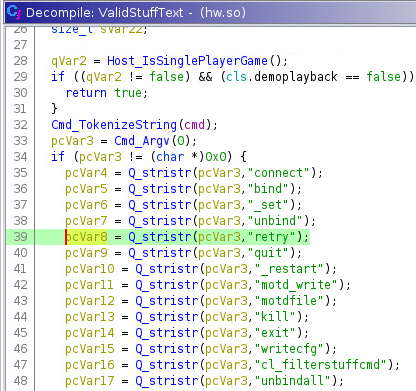
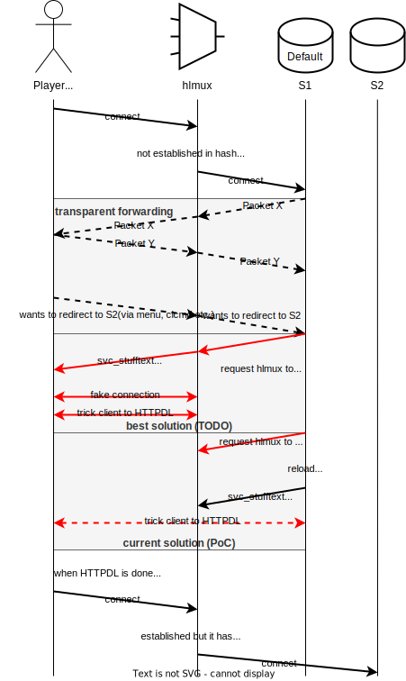

# hlmux

Multiplexer for Half-Life games (and its mods)

<div align="center">


</div>

*hlmux* is a gateway of multiple upstream GoldSource servers, offering a mechanism to redirect a client among these upstreams.

⚠ THIS PROJECT IS STILL UNDER CONSTRUCTION.

## Usage

*hlmux* is a Go package, and theoretically it's just a building block for a gateway application.

### hlmuxd

For convenience, we offer an official gateway application [*hlmuxd*](./cmd/hlmuxd) to ease most users' pains. It also serves as an example to demonstrate the usage of *hlmux*.

* Compilation

```
mkdir -p ./bin
go build -o ./bin ./cmd/hlmuxd
```

* Sample configuration (`config.json`)

```json
{
    "bind": "0.0.0.0:27015",
    "api": "0.0.0.0:27081",
    "ttl": "30",
    "upstreams": [
        {
            "name": "cs1",
            "address": "10.1.80.51:27001",
            "default": true
        },
        {
            "name": "cs2",
            "address": "10.1.80.51:27002"
        }
    ]
}
```

* Running

```
./bin/hlmuxd -config config.json

# or without compilation
go run ./cmd/hlmuxd -config config.json
```

## How does it work?

Valve has banned `connect` command for a long time ([related issue][redirect-issue])
as a part of [admin slowhacking][admin-slowhacking] mitigation. Many redirection plugins does not work any more, while they do serve
as practical components, especially in community servers.

This project implements a gateway in front of multiple GoldSource game servers, so that the
gateway can have its own decision on the traffic forwarding.
After in-game plugins tell the gateway which nexthop the clients want, their traffic will be forwarded to the target server when they send handshakes next time.

The client side command `retry` is able to invoke re-handshaking (which is different from `reconnect`). Unfortunately, we have known that Valve's [page][admin-slowhacking] is out of date by inspecting `hw.so` (or `hw.dll` on Windows) as shown below: `retry` is also banned, regardless of the value of `cl_filterstuffcmd`.



Good news is that there is still an approach to trick the clients into a state similar to a manually-issued `retry`. This is a sequential diagram of `hlmux`.



[admin-slowhacking]: https://developer.valvesoftware.com/wiki/Admin_Slowhacking
[redirect-issue]: https://github.com/ValveSoftware/halflife/issues/5